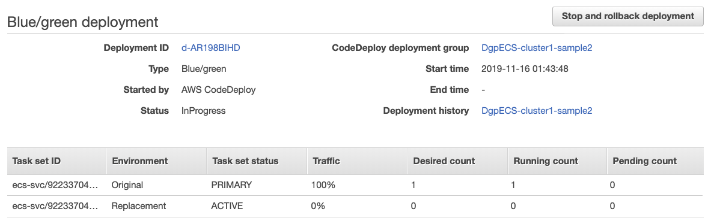
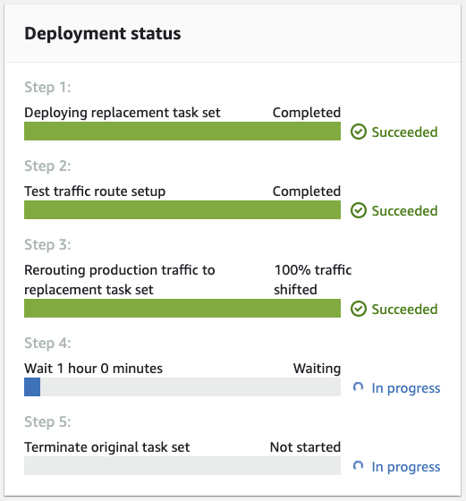
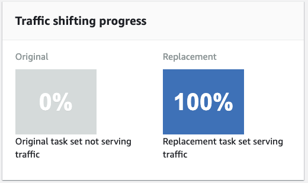

<br><br>
<br><br>
<br><br>

# Blue-Green Deployment in ECS


## LAB Overview

#### This lab will demonstrate:
 * Using CodeDeploy to implement Blue/Green Deployment for AWS Fargate


## Task 1: Creating Cloud9 Environemnt
1.  In the AWS Management Console, on the **Services** menu, click **Cloud9**.
2.  Click **Create Environemnt**.
3.  Enter a **Name**: *student-x-cloud9*
4.  Choose **Create a new no-ingress EC2 instance for environment (access via Systems Manager)**
5.  Click **t3.small** as an **instance type**
6.  Leave everything else for default values
7.  Finish creation with click **Create Environemnt**.

## Task 2: Creating and attaching a EC2 role
Short description

1. In the AWS Management Console, on the **Services** menu, click **IAM**.
2. In the navigation pane on the left, click **Roles**.
3. Click **Create role**.
4. **Select type of trusted entity** choose: *AWS service*.
5. **Choose a use case** choose: *EC2*.
6. Click **Nest: Permissions**.
7. Find and select **AmazonEC2ContainerRegistryFullAccess**.
8. Find and select **AWSCloud9SSMInstanceProfile**.
9. Click **Next: Tags**.
10. Click **Next: Review**.
11. Enter a name for your new role *student-X-EC2-Cloud9-ECS-role*.
12. Click **Create role**.
13. In the AWS Management Console, on the **Services** menu, click **EC2**
14. Select your EC2 instance, click **Actions**,select **Instance Settings**, and then select **Attach/Replace IAM Role**.
15. Select the role you created in step 10 and click **Apply**.


## Task 3: Prepare Flask app.

1. Open your *Cloud9* environment.
2. In the terminal type ``cd`` and press *Enter* to enter your home directory.
3. Create directory. Type ``mkdir myapp`` and press *Enter*.
4. Enter the ditectory by typing ``cd myapp`` and press *Enter*.
5. Create and edit a new file by entering ``nano app.py```.
6. Download [app.py file](Files/app.py) and paste its content into nano editor.
7. Press **CTRL+O** and **CTRL+X** to save the file.
8. Include Flask into requirements by entering ``echo "Flask" > requirements.txt``.
9. Create Dokerfile by entering ``nano Dockerfile``.
10. Download [Dockerfile](Files/Dockerfile) and paste its content into nano editor.
11. Press **CTRL+O** and **CTRL+X** to save the file.
12. Build the app by entering ``docker build -t myapp:latest .`` 
13. After the build compiles you can try run it by: ``docker run -d -p 5000:5000 myapp``

If the app does not start run it in interactive mode:
``docker run -it -p 5000:5000 myapp`` and look into any errors.

14. Still in the terminal enter ``curl localhost:5000``, press *Enter* and check if your app responses.
15. Type ``docker ps`` press *Enter* and copy *the CONTAINER ID* of your docker.
16. Type ``docker stop CONTAINER_ID`` and press *Enter*.

## Task 4: Creating ECR repository

1. On the **Services** menu, click **ECS**.
2. From list on the left, click **Repositories**. 
3. Click **Create repository**.
4. Enter a name for your repository: *student-X-ecr*.
5. Click **Create repository**.
6. Click *your repository name*.
7. Click **View push commands**.
8. Copy first command. It looks like ``aws ecr get-login-password ...``.
9. Go back to your *Cloud 9* environment and paste the command.
10. Repeat steps 8 and 9 for the rest of the push commands.

After the upload finishes, you should have your new image built and uploaded to your images repository.

11. Go back to *ECR* and click **Close**.
12. Click *Refresh button* and check the list of images. There should be your image.
13. Copy and remember your *Image URI*.

## Task 5: Creating Fargate cluster.
1. In the AWS Management Console, on the **Services** menu, click **Elastic Container Service**.
2. On the left panel, below Amazon ECS click *Clusters*.
3. Click **Create cluster**.
4. Click **Networking only** and **Next step**.
5. Enter an name for your cluster: *student-x-fargate*.
6. Click **Create**.
7. Click **View Cluster**.

## Task 6: Creating CodeDeploy role.

1. In the AWS Management Console, on the **Services** menu, click **IAM**.
2. Choose **Roles** and click **Create Role**.
3. For **Select type of trusted entity** section, choose **AWS service**.
4. For **Choose a use case**, choose **CodeDeploy**.
5. For **Select your use case**, choose **CodeDeploy**, click **Next: Permissions**.
6. Choose **Next: Tags**.
7. Choose **Next:Review**.
8. For **Role name**, type *ecsCodeDeployRole*, enter an optional description, and then choose **Create role**.
9. Select your role.
10. Click **Add inline policy**.
11. Click **JSON** and paste contents of [the policy file](Files/policy.json).
12. Click **Review policy**
13. Enter policy **Name**
12. Click **Create policy**
13. Click **Add inline policy**.
14. Click **JSON** and paste contents of [the policy file](Files/policy2.json).
15. Save changes.

## Task 7: Creating Load Balancer

1. On the **Services** menu, click **EC2**.
2. On the left panel click **Load balancers**.
3. Click **Create Load Balancer**.
4. Select **Application Load Balancers** and click **Create**.
5. Enter a name for your load balancer: *student-X-ALB*.
6. Select "internet-facing" option.
7. Leave listener option as it is.
8. Select your *VPC** and add all subnets.
9. Click **Next: Configure Secutiry Settings**.
10. Click **Next: Configure Secutiry Groups**.
11. Select **Create a new security group**.
12. Enter a name for your security group "student-X-sg-ecs"
13. Select *HTTP* as **Type**, *80* as **Port range** and *Anywhere* as **Source**.
14. Click **Next: Configure Routing**.
15. Select *New target group* as **Target group**.
16. Enter a name for your target group, "student-X-tg1".
17. For **Target type**, choose to register your targets with an IP address.
18. Select **Override** in **Advanced health check settings**.
19. Enter *5000* as **Port**.
20. Click **Next: Register Targets**.
21. Click **Next: Review**.
22. Click **Create**.
23. Click **Close**.

## Task 8: Modyfing previously created security group

1. On the **Services** menu, click **VPC**.
2. On the left panel click **Security Groups**.
3. Find your SG (created in previous task) with name: "student-X-sg-ecs".
4. After you select it, click on **Inboud rules** tab.
5. Click **Edit inboud rules**.
6. Add a new rule by clicking **Add rule**.
7. Change dropdown position from "Custom TCP" to **All traffic**.
9. For source start typing name of security group itself.
10. Please double check your input - you should self reference security group.
11. Click **Save rules**

## Task 9: Creating Task Execution Role

1. In the AWS Management Console, on the **Services** menu, click **IAM**.
2. Choose **Roles** and click **Create Role**.
3. For **Select type of trusted entity** section, choose **AWS service**.
4. For **Choose a use case**, choose **Elastic Container Service**.
5. For **Select your use case**, choose **Elastic Container Service Task**, click **Next: Permissions**.
6. Click **Nest: Permissions**.
7. Find and select **AmazonECSTaskExecutionRolePolicy**.
9. Click **Next: Tags**.
10. Click **Next: Review**.
11. Enter a name for your new role *student-X-ECS-Task-role*.
12. Click **Create role**.
13. Please type somewhere ARN of created IAM Role.

## Task 10: Creating Task Definition

1. Download and modify file of [definition file](Files/taks_definition.json)
2. Inside **executionRoleArn** node remove value and paste your role ARN.
3. Inside **containerDefinitions** and **image** node remove value and paste your ECR repository URI (copy it from web console)
4. Copy whole content of your modified file into memory.
5. In web console open the **Services** menu, click **ECS**.
6. Click **Task Definitions** and **Create new Task Definition**.
7. Choose **Fargate** and click **Next step**.
8. Scroll down and click **Configure via JSON**.
9. Paste content from memory as a task definition.
10. Click **Save**.
11. Click **Create**.
12. Click **View task definition**.

## Task 11: Creating an Amazon ECS service with blue/green deployments

1. On the **Services** menu, click **ECS**.
2. Click **Clusters**.
3. Choose your cluster and select **Services**.
4. Click **Create**.
5. For the **Launch** type, choose **FARGATE**.
6. For **Task Definition**, choose the sample-website task definition that you created earlier.
7. Choose the cluster where you want to run your applications tasks.
8. For **Service Name**, enter Sample-Website.
9. For **Number of tasks**, specify the number of tasks that you want your service to run.
10. For **Deployment type** choose **Blue/green deployment (powered by AWS CodeDeploy)**.
11. For the **Service role**, choose the CodeDeploy service role you created earlier.
12. Click **Next step**.
13. Under **VPC and security groups**:
* From Subnets, choose the subnets that you want to use for your service.
* For Security groups, choose Edit.
* For Assigned security groups, choose Select existing security group.
* Under Existing security groups, choose the sample-website-sg group that you created earlier.
14. Choose Save.
15. Under **Load Balancing**:
* Choose Application Load Balancer.
* For Load balancer name, choose sample-website-alb.
* Under Container to load balance:
* Choose Add to load balancer.
* For Production listener port, choose 80:HTTP from the first drop-down list.
* For Test listener port, in Enter a listener port, enter 5000.
16. Under **Additional configuration**:
* Set **Path patterns** to */**
* Set **Health check path** to /.
* Turn off **Service discovery**.
17. Click **Next step**.
18. Do not configure Auto Scaling. 
19. Choose **Next step**.
20. Review your service for accuracy, and then choose **Create service**.
21. If everything is created successfully, choose **View service**.

You should now see your newly created service, with at least one task running.

22. Now you can chack if your website is running. Open your LoadBalancer url in any prowset of your choice.
23. In the AWS **CodeDeploy** console, you will see that the Amazon ECS Configure service wizard has created a CodeDeploy application for you. Click into the application to see other details, including the deployment group that was created for you.

## Task 12: Triggering a CodeDeploy blue/green deployment

1. On the **Services** menu, click **ECS**.
2. From the navigation pane, choose **Task Definitions**.
3. Choose your sample-website task definition, and then choose **Create new revision**.
4. Under Tags:
* In **Add key**, enter *Name*.
* In **Add value**, enter *Sample Website*.
5. Choose **Actions**.
6. Choose **Update**.
7. Under **Configure service**, for **Task Definition**, check that value *2 (latest)* is selected from the **Revision** drop-down list.
8. Click **Next step**.
9. Skip **Configure deployments**. Click **Next step**.
10. Skip **Configure network**. Click **Next step**.
11. Skip **Set Auto Scaling (optional)**. Click **Next step**.
12. Review the changes, and then click **Update Service**.
13. Click **View Service**.

You are now be taken to the Deployments tab of your service where you can see details about your blue/green deployment.



16. You can click the deployment ID to go to the details view for the CodeDeploy deployment.
17. From there you can see the deployments status.


and traffic shifting


If you notice issues, you can stop and roll back the deployment. This shifts traffic back to the original (blue) task set and stops the deployment.

By default, CodeDeploy waits one hour after a successful deployment before it terminates the original task set. You can use the AWS CodeDeploy console to shorten this interval. After the task set is terminated, CodeDeploy marks the deployment complete.

<br><br>


## END LAB
<br><br>

<p align="right">&copy; 2020 Welastic Sp. z o.o.<p>
