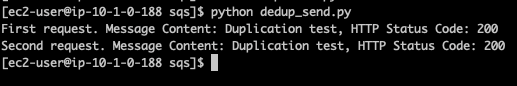

  
  
  

# SQS and Python SDK

## LAB Overview

#### In this lab you will use SQS FIFO queue to send and read messages. you will use content deduplication and later you will take carte of the deduplication by yourself.

## Task 1: Creating FIFO queue

1. In the AWS Management Console, on the **Services** menu, click **SQS**.
2. Click **Get started** or **Create queue**.
3. Enter a **Queue Name**: *student-x-queue.fifo*.
4. Select **FIFO Queue**.
5. Scroll down to **Configuration** section. 
6. Set **Default Visibility Timeout** to 5 seconds.
7. Turn **Content-Based Deduplication** on by checking the checkmark.
8. Leave the rest unchanged and click **Create Queue**.

## Task 2: Creating Cloud9 Environemnt
1.  In the AWS Management Console, on the **Services** menu, click **Cloud9**.
2.  Click **Create Environemnt**.
3.  Enter a **Name**: *student-x-cloud9*
4.  Choose **Create a new no-ingress EC2 instance for environment (access via Systems Manager)**
5.  Click **t3.small** as an **instance type**
6.  Leave everything else for default values
7.  Finish creation with click **Create Environemnt**.

## Task 3: Creating and attaching EC2 role

1.  In the AWS Management Console, on the **Services** menu, click **IAM**.
2.  Click **Roles**.
3.  Click **Create role**.
4.  Choose **EC2** as service that will use the role.
5.  Click **Next: Permissions**.
6.  Find **AmazonSQSFullAccess** policy and add it to the role.
7.  Find **AWSCloud9SSMInstanceProfile** policy and add it to the role.
8.  Click **Next: Tags**.
8.  Click **Next: Review**.
10.  Enter a **Role name**: *student-EC2-Cloud9-role*.
11. Click **Create role**.
12. In the AWS Management Console, on the Services menu, click **EC2**.
13. In the navigation pane on the left, click **Instances**.
14. Select your instance and press **Action**.
15. Go to **Instance Settings** and choose **Attach/Replace IAM Role**.
16. Select your IAM role and press **Apply**.

If case of problem with role select *No Role* Apply and select your Role 

## Task 4: Sending messages to the queue

We will send messages to one queue but two groups.

1.  Open Cloud9 service and **Open IDE** for your instance.
2.  If terminal exists please use it otherwise click in top menu **Window** and **New Terminal**
3.  Type: **sudo su**
4.  Create a directory: ``mkdir sqs``.
5.  Enter the directory: ``cd sqs``.
6.  Create and edit a file: ``nano send.py``.
7.  Download [send.py file](Files/send.py) and paste its content into editor.
8.  Edit file and and set *QUEUE_NAME* variable to your queue name.
9.  Press CTRL-O to save the file.
10.  Press CTRL-X to exit nano.
11.  Type ``python send.py`` to send messages.
12.  If you receive error about no Boto3 module, please type: ``pip install boto3``.

Now, there should be 6 messages in your queue. You can open the SQS console and look if everything is ok.

## Task 5. Reading messages

We will read messages from one queue. We will make two requests. The queue does not know there is one client and will response with 4 messages.

1.  Back in the Cloud9 terminal create new file by typing ``nano read.py``.
2.  Download [read.py file](Files/read.py) and paste its content into editor.
3.  Edit file and and set *QUEUE_NAME* variable to your queue name.
4.  Press CTRL-O to save the file.
5.  Press CTRL-X to exit nano.
6.  Type ``python read.py`` to read messages.

Messages are still in the queue. We read them but did not delete. You can check that in the SQS console.

## Task 6: Deleteing messages

1.  Create new file by typing ``nano delete.py``.
2.  Download [delete.py file](Files/delete.py) and paste its content into editor.
3.  Edit file and and set *QUEUE_NAME* variable to your queue name.
4.  Press CTRL-O to save the file.
5.  Press CTRL-X to exit nano.
6.  Type ``python delete.py`` to delete messages.

Now, we deleted one message. You can open SQS console and there should be 5 messages still in the queue.

7. Type Type ``python read.py`` to read messages.

You should get different messages. One of the previously read messages in now deleted.

8.  Go to the SQS console and select your queue.
10. Click **Purge**.
11. Confirm by typing *purge*.
11. Click **Purge**.
12. Click **OK**.

Now, the queue is empty.

## Task 7: Examining deduplication

1.  Create new file by typing ``nano dedup_send.py``.
2.  Download [dedup_send.py file](Files/dedup_send.py) and paste its content into editor.
3.  Edit file and and set *QUEUE_NAME* variable to your queue name.
4.  Press CTRL-O to save the file.
5.  Press CTRL-X to exit nano.
6.  Type ``python dedup_send.py`` to send messages.

7. Examine the response (two success messages) and check the amount of messages in the queue.

There is one message in the queue.

8.  Go to the SQS console and select your queue.
9.  Click **Queue Actions**.
10. Select **Purge Queue**.
11. Click **Yes, Purge queue**.
12. Click **OK**.

## Task 8. Taking care of the deduplication

1.  Click **Edit**.
2.  Scroll down to **Configuration**
3.  Uncheck **Content-Based Deduplication** option.
4.  Click **Save**.
5.  Back in the ssh console create new file by typing ``nano deduplication.py``.
6.  Download [deduplication.py file](Files/deduplication.py) and paste its content into editor.
7.  Edit file and and set *QUEUE_NAME* variable to your queue name.
8.  Press CTRL-O to save the file.
9.  Press CTRL-X to exit nano.
10. Type ``python deduplication.py`` to send messages.
11. Go to the SQS console and check how many messages there is in the queue.

## END LAB

Please, delete the queue.

  

&copy; 2020 Welastic Sp. z o.o.

